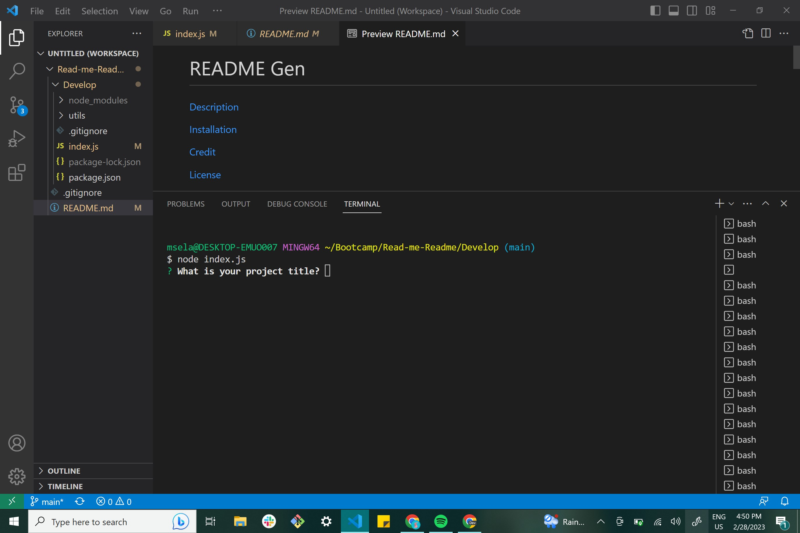

# README Generator

[Description](https://github.com/MariCods/Read-me-Readme/blob/main/Develop/README.md#description)

[Installation](https://github.com/MariCods/Read-me-Readme/blob/main/Develop/README.md#installation)

[Credit](https://github.com/MariCods/Read-me-Readme/blob/main/Develop/README.md#credit)

[License](https://github.com/MariCods/Read-me-Readme/blob/main/Develop/README.md#license)

[Features](https://github.com/MariCods/Read-me-Readme/blob/main/Develop/README.md#features)

[Contributions](https://github.com/MariCods/Read-me-Readme/blob/main/Develop/README.md#contributions)

[Test](https://github.com/MariCods/Read-me-Readme/blob/main/Develop/README.md#test)

[Questions](https://github.com/MariCods/Read-me-Readme/blob/main/Develop/README.md#questions)

# Description
 This is a Readme Generator I coded using Node, Inquirer, and javascript. Upon being prompted on a command line the option to put in information to generate a readme appears on after another.This high quality README.md is generated with the title as well as sections entitled: Decription, Table of Contents, Installation, Usage, License, Contributing, Tests, and Questions. After I enter the decription, installation andother sections this information will be generated on the same sections on the readme. When I choose a license from my choices prompted then a badge for that license will be added to the license section with a link to the information on the license. When I add my github username it is added to the question section of the readme with a link to the inputed Github. After inputing your email it is added to the Questions section of the readme and is linked. There are also instructions on how to get in contact with me or ask additonal questions. When I click the links in the table of contents I am taken to the corresponding section of the README.

# Installation
I downloaded the starter code. I then worked on the question object then the README markdown. Last but not least I worked on the actual intialization code to get the prompts working. I also downloaded inquirer in the begining. I then went through a step of debugging followed by a final test and pushed my changes to Github throughout.

# Credit
N/A

# License
   

# Features
Generates a README.md file

# Contributions
N/A

# Test
Clone file folder and run this program in a command-line terminal to test and use. Run npm test if further issues come up. Make sure to download node and inquirer.

# Questions
MariCods(https://github.com/MariCods)

Please contact me at mselassie@ucdavis.edu if you have any further questions for comments. I will get back to you as soon as possible.

Video Usage Link(https://drive.google.com/file/d/1Jw8BwIsUK7yxUyN5TkXvKtyz3UYFdptq/view)